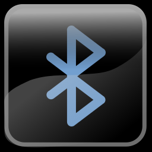

# Kodi Repository for Linux Tools

Contains the following addons

| |       |         |
|:--------------:|:-----------:|:------------:|	
|Pulse Equalizer|Media Player Remote Interface|Bluetooth Manager|

## Installation

Download "repository.linuxaddons-x.y.z.zip" from this repository and install it within Kodi via "Install from zip file" or extract it into the "~/.kodi/addons" folder. In the latter case, restart Kodi.

	wget https://raw.github.com/wastis/LinuxAddonRepo/master/repository.linuxaddons-1.0.0.zip
	unzip -d ~/.kodi/addons repository.linuxaddons-1.0.0.zip

Once installed, select "Install from repository" -> "Linux Addon Repository"

Select the desired addon. 

## System Prerequisites

### Pulse Equalizer

This addon communicates with pulseaudio via the dbus interface, pulseaudio and dbus must be up and running.

It further requires pulseaudio-equalizer installed on the system

	sudo apt install pulseaudio-equalizer

### Bluetooth Manager

This addon communicates with bluez via the dbus interface, bluez and dbus must be up and running. In case of bluetooth audio devices, the module "pulseaudio-module-bluetooth" needs to be installed.

	sudo apt install pulseaudio-module-bluetooth
	systemctl --user restart pulseaudio

2022 wastis

